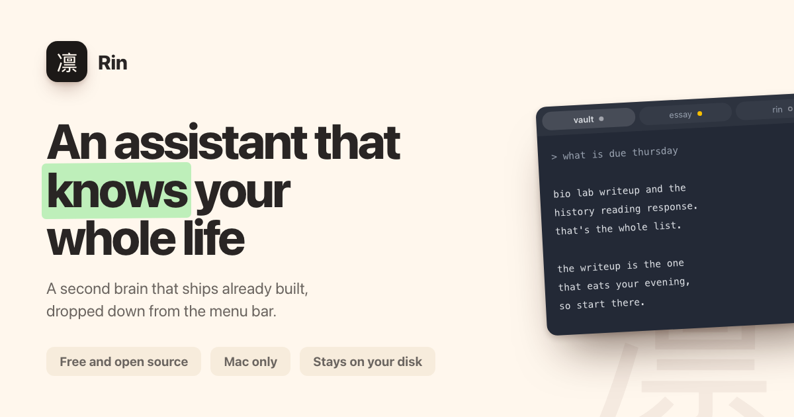

<div align="center">


# Rin

**A Claude brain wrapped in an app.**

One keystroke and a terminal drops down from your menu bar, sessions already
open, one per tab, sitting in the folder that holds your notes. The tabs stick
around through quits, restarts, and a week of you forgetting it exists.


[](https://github.com/exata531/Rin/releases/latest)
[](https://github.com/exata531/Rin/releases/latest)
[](LICENSE)

[Website](https://petermei.com/rin/) · [Install](#install) ·
[Modules](#modules) · [Writing a module](docs/modules.md) ·
[Build from source](#build-from-source)



</div>

Rin is the window. Claude Code is the thing running inside it. On first run it
helps you build a brain, which is just a folder structure your assistant reads
and writes so it actually knows your stuff (your deadlines, your projects,
your week) instead of you explaining your life again every morning. It ships
completely blank, see [`skeleton/`](skeleton/). Nothing in it comes from me or
anyone else.

## What it does

- **Drops down from anywhere.** Control + backtick and it's there, doesn't
  matter what app you're in. Always opens in your brain folder, at the size
  you left it.
- **Tabs that survive.** Quit the app, restart the Mac, whatever. Every tab
  comes back on the conversation it was holding. Rename with a right click,
  drag to reorder, and ⌘1 through ⌘9 always match the order on the bar.
- **State at a glance.** Every session gets a dot on its tab: working, wants
  you, ended. Color only shows up when something actually needs you, so an
  alert looks like an alert. The menu bar icon breathes while a session is
  thinking, pulses when one wants you, and gives the trackpad a little tap
  for commits and refusals.
- **A face.** There's a kaomoji next to the icon showing the assistant's mood.
  It drifts through the day, reacts to real work, and never repeats itself.
  Sometimes the assistant talks first, a small note under the icon, and
  tapping it opens the conversation.
- **Finds things.** ⌘F searches a tab's scrollback, ⌘K jumps to any tab if
  you type a few letters of its name.
- **Files conversations into your brain.** Right click a tab and the whole
  thing lands in your inbox as a clean Markdown note, no tool spam.
- **Session starters.** Right click the new-session button and you get
  openers your own assistant wrote (from `_meta/starters.json` in your
  brain). The app just carries the tray.
- **Refuses to lose your work.** A live session only closes if you hold the
  close button down. Learned that one the hard way.
- **Silent in class.** The bell is a dot and a trackpad tap, that's it. If
  you want the bells you missed, there's a switch in Settings that routes
  them through Notification Center while you're away, and tapping the alert
  drops you in the panel.
- **Explains itself.** A little tour shows up once after first run, every
  shortcut lives on ⌘/, and a tab that can't start tells you what to try
  instead of just glowing red at you.
- **A real terminal.** Its own palette, a block cursor, and smooth scrolling
  like every other Mac window. Drag files onto the icon to hand them over.
- **Stays out of the way.** Polling slows down when the panel is closed, tabs
  you're not looking at don't get drawn, and Claude Code keeps itself updated
  weekly.
- **Answers `rin://install/<module>`** from the modules page by opening a
  session on it. See [Modules](#modules).

## Install

Rin is free, open source, and not in the App Store. You download it, drop it
in Applications, and tell your Mac once that it's allowed to run. Needs macOS
14 or later:

1. [Download the latest release](https://github.com/exata531/Rin/releases/latest).
   If it comes down as a zip, double click it to unpack. You end up with
   `Rin.app`.
2. Drag `Rin.app` into your **Applications** folder.
3. Double click it. macOS is gonna warn you that it couldn't verify Rin is
   free of malware. Every app without a paid Apple certificate gets that
   warning, nothing is wrong with your Mac. See
   [Why the warning](#why-the-warning) below.
4. Press **Done**. Not **Move to Trash**.
   <!--  -->
5. Open **System Settings** from the Apple menu at the top left, then click
   **Privacy & Security** in the sidebar.
6. Scroll down to the Security section. There's a line saying "Rin" was
   blocked to protect your Mac.
7. Press **Open Anyway** next to it and confirm with your password or Touch
   ID. If a second warning pops up, press **Open Anyway** there too.
   <!--  -->
8. Rin shows up at the right end of your menu bar as 凛. No Dock icon, no
   window in Mission Control. The menu bar is where it lives.
   <!--  -->
9. Press Control + backtick (the ` key, above Tab). The panel drops down and
   first run walks you through the rest, including installing Claude Code and
   signing in if you haven't already.
   <!--  -->

You only do the Settings trip once. After that it's a normal double click,
and first run offers to start Rin at login so you never think about launching
it again.

<details>
<summary>On macOS 14 there is a shortcut</summary>

Right click `Rin.app`, choose Open, then press Open again in the dialog. Apple
retired that route in macOS 15, which is why the steps above go through System
Settings.

</details>

### Why the warning

Rin isn't signed because I don't have a paid Apple developer subscription. Everything
it does is in this repo where you can read it, and if you'd rather not trust
a download from a stranger, the two commands under
[Build from source](#build-from-source) make the exact same app on your own
machine.

## Keyboard

Every key, also on ⌘/ inside the app.

| Key | Does |
| --- | --- |
| ⌃ ` | Show or hide the panel, from any app |
| ⌃ , | The same, easier to reach |
| ⌘ T | New session |
| ⌘ 1 to 9 | Jump straight to that tab |
| ⌘ K | Find a tab by typing its name |
| ⌘ W | Close a tab if it isn't working. Hold its × to close it anyway |
| ⌘ F | Find in this tab's scrollback; ⌘G and ⇧⌘G step through matches |
| ⌘ + / ⌘ − / ⌘ 0 | Text bigger, smaller, back to normal |
| ⌘ / | The keyboard card |
| ⌘ Q | Quit Rin |

## Modules

A module is a folder of plain files that teaches your assistant one new job.
How to run your weekly review, how to keep a reading log, how to quiz you
before a test.

There's no modules screen, you just ask in any tab:

```
/install flashcards
```

The assistant reads out what the module adds, whether it ships scripts,
whether anything in it runs on its own, and then waits for you to say yes.
`/module` handles the rest: what's on the list, what you already have,
removing one, writing your own. And on the
[modules page](https://petermei.com/rin/modules.html) every card has an
**Add to Rin** button that opens a tab already asking. Same thing, fewer
keystrokes, and Rin still checks before it opens anything.

Modules live in your own brain folder at `.claude/skills/<name>/`, so they
travel with your notes and nothing global on your Mac gets touched.
Uninstalling is deleting a folder (it goes to the Trash, not gone forever).

Writing one is literally just asking. *"make me a module that tracks my
runs"* scaffolds the folder, writes the instructions, and it works in the
next tab you open. Publishing one is a pull request that adds a single line
to [`modules/registry.json`](modules/registry.json). The full guide is
[docs/modules.md](docs/modules.md).

The list starts empty on purpose. The first few modules got written and then
taken off again, because asking your assistant for one is faster than browsing
for one ([`modules/removed.json`](modules/removed.json) has the receipts).

> [!WARNING]
> **Nothing on the list is audited.** Every module comes from whoever wrote
> it. An automatic check reads its files at the pinned commit and works out
> whether it runs code, whether it reaches the network, and what any hook of
> it runs, so those labels come from the files, not from the author's
> description. Then one person reads it. That catches carelessness, not a
> determined author. Listing is not endorsement.

## Privacy

Rin has no server of its own, no account, and no sync. The app makes zero
network requests of its own. Everything on the wire is Claude Code's, under
the account you signed into, plus the module list and a module's files when
you ask for one by name. Rin reads Claude's own files on your disk
(`~/.claude`) to restore and label your sessions.

A module you install can change that. Some ship scripts, and some talk to a
service of their own. Every module says which before it's added, worked out
from its actual files rather than from what the author claims, and nothing
on the list has been audited by anyone. See the warning above.

## Build from source

```sh
# Requires Xcode command line tools and xcodegen
git clone https://github.com/exata531/Rin.git
cd Rin
xcodegen generate
xcodebuild -scheme Rin -configuration Release
```

## License

[MIT](LICENSE). [SwiftTerm](https://github.com/migueldeicaza/SwiftTerm),
which Rin bundles, is also MIT.
